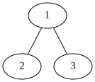
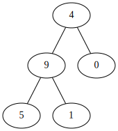

### 129. Sum Root to Leaf Numbers
<span style="color:rgb(239, 108, 0)">Medium</span> &nbsp; **favorable:** 2142 &nbsp; **unfavorable:** 56

You are given the `root` of a binary tree containing digits from `0` to `9` only.

Each root-to-leaf path in the tree represents a number.
- For example, the root-to-leaf path `1 -> 2 -> 3` represents the number `123`.
Return the total sum of all root-to-leaf numbers.

A `leaf` node is a node with no children.

#### Example 1:

```
<span style="font-weight:bold">Input:</span> root = [1,2,3]
<span style="font-weight:bold">Output</span>: 25
<span style="font-weight:bold">Explanation</span>:
The root-to-leaf path 1->2 represents the number 12.
The root-to-leaf path 1->3 represents the number 13.
Therefore, sum = 12 + 13 = 25.
```

#### Example 2:

```
<span style="font-weight:bold">Input:</span> root = [4,9,0,5,1]
<span style="font-weight:bold">Output:</span> 1026
<span style="font-weight:bold">Explanation:</span>
The root-to-leaf path 4->9->5 represents the number 495.
The root-to-leaf path 4->9->1 represents the number 491.
The root-to-leaf path 4->0 represents the number 40.
Therefore, sum = 495 + 491 + 40 = 1026.
``` 

#### Constraints:
- The number of nodes in the tree is in the range [1, 1000].
- 0 <= Node.val <= 9
- The depth of the tree will not exceed 10.
