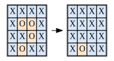

### 130. Surrounded Regions
<span style="color:rgb(239, 108, 0)">Medium</span> &nbsp; **favorable:** 2587 &nbsp; **unfavorable:** 759

Given an m x n matrix board containing 'X' and 'O', capture all regions surrounded by 'X'.

A region is captured by flipping all 'O's into 'X's in that surrounded region.

#### Example 1:

```
<strong>Input:</strong> board = [
    ["X","X","X","X"],
    ["X","O","O","X"],
    ["X","X","O","X"],
    ["X","O","X","X"]
]
<strong>Output:</strong> [
    ["X","X","X","X"],
    ["X","X","X","X"],
    ["X","X","X","X"],
    ["X","O","X","X"]
]
<strong>Explanation:</strong> Surrounded regions should not be on the border, which means that any 'O' on the 
border of the board are not flipped to 'X'. Any 'O' that is not on the border and it is not 
connected to an 'O' on the border will be flipped to 'X'. Two cells are connected if they 
are adjacent cells connected horizontally or vertically.
```
#### Example 2:
```
<strong>Input:</strong> board = [["X"]]
<strong>Output:</strong> [["X"]]
```

#### Constraints:
- m == board.length
- n == board[i].length
- 1 <= m, n <= 200
- board[i][j] is 'X' or 'O'.
